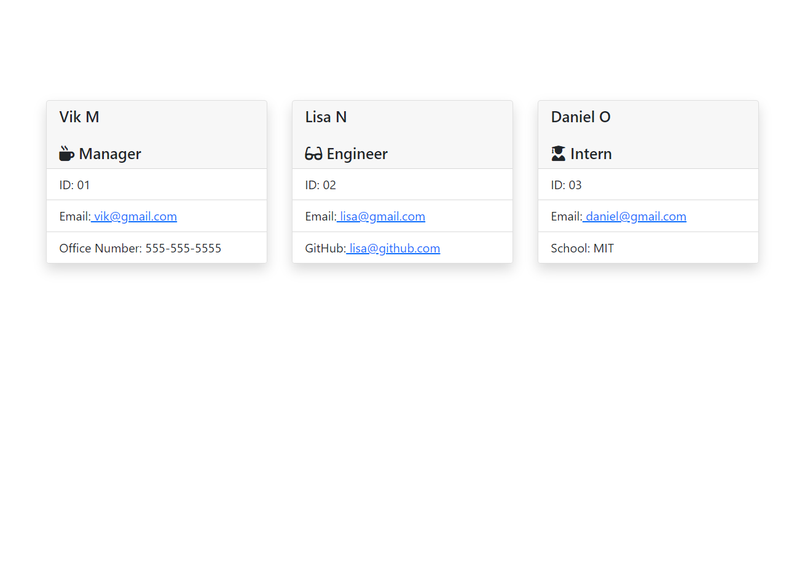

# Vik's Team Profile Generator

## Description

Working on a team often requires things to get done quickly and efficiently, and as a valued team member you may want to quickly generate a webpage that can display a team’s general info – so you can have quick access to their names, emails, contact info, and GitHub profiles.

Enter the purpose of this project: utilize Node.js in the command-line to build a team-displaying HMTL file based on user input. The application runs entirely in the browser, can be viewed anywhere online, and includes the following features:

- Once the application starts, the user is prompted for team members and their information.
- The user is prompted to enter the team manager’s name, employee ID, email address, and office number, or information for an engineer or intern as well.
- After the user finishes entering a member’s name and info, they are presented with a menu with the option to add an additional member of the team.
- Once the user is finished building their team, they are able to exit the application, and the HTML file is generated which displays a nicely formatted team roster based on the user input.
- When an email address is clicked on in the generated webpage, the user’s default email program opens and populates the "TO" field of the email with the address
- The user can also click on the GitHub username and that profile opens in a new tab


## Installation

To install this application, first clone the repo to your local machine. Then, you will need to install the node dependencies/modules which can be done by running the ```npm install``` command in your terminal/bash shell. Once this has been completed, you are ready to use the application, and can start the program with either the command ```node index.js``` or ```npm run start```.


## Usage

To use this application, first, pull up the repo's folder in your terminal/bash shell and run the command ```node app,js``` or ```npm run start```. This will then prompt you with the welcome message and how to use the program. Read the messages and either select from the list what you want to submit, or submit the requested information. You will be prompted for information such as full names, emails, employee ID numbers, GitHub profiles, office numbers, and university/schools depending on the type of team member you are submitting. 

Once your team has been added in full to the application, you can select the “no” option for adding new team members. This will complete the application and export the HTML file to the **/dist** output folder . You can now view this HTML file or host it on your website to display your team profiles.

Here is an example of the generated webpage:




A full video walkthrough of the program can be found [here](https://drive.google.com/drive/folders/1wHIMCnUtTyJAyb9Omcfo1nvj9EZcNyx2?usp=sharing).


## Testing

This program was build using class syntax and constructor functions. The function for each employee type was tested before building out the rest of the program. These tests are run with the Jest node package dependency (which is installed with the ```npm install``` command).
 To run the tests, enter the ```run npm test``` command. 


## Credits

Collaborators include the instructor, TAs, and fellow classmates of the UCF Coding Bootcamp (Spring 2022).


## License

Copyright (c) 2022 Vik Maharaj

Permission is hereby granted, free of charge, to any person obtaining a copy of this software and associated documentation files (the "Software"), to deal
in the Software without restriction, including without limitation the rights to use, copy, modify, merge, publish, distribute, sublicense, and/or sell copies of the Software, and to permit persons to whom the Software is furnished to do so, subject to the following conditions:

The above copyright notice and this permission notice shall be included in all copies or substantial portions of the Software.

THE SOFTWARE IS PROVIDED "AS IS", WITHOUT WARRANTY OF ANY KIND, EXPRESS OR IMPLIED, INCLUDING BUT NOT LIMITED TO THE WARRANTIES OF MERCHANTABILITY,
FITNESS FOR A PARTICULAR PURPOSE AND NONINFRINGEMENT. IN NO EVENT SHALL THE AUTHORS OR COPYRIGHT HOLDERS BE LIABLE FOR ANY CLAIM, DAMAGES OR OTHER LIABILITY, WHETHER IN AN ACTION OF CONTRACT, TORT OR OTHERWISE, ARISING FROM, OUT OF OR IN CONNECTION WITH THE SOFTWARE OR THE USE OR OTHER DEALINGS IN THE SOFTWARE.


## Badges


[](https://opensource.org/licenses/MIT)
